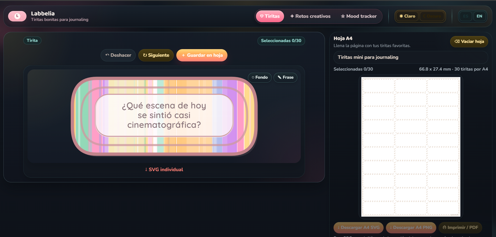
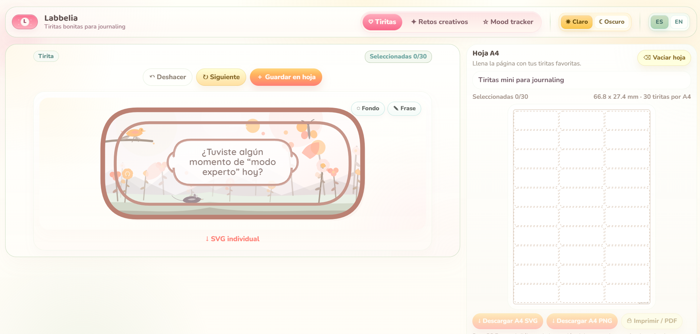
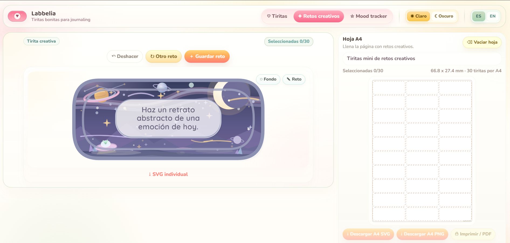
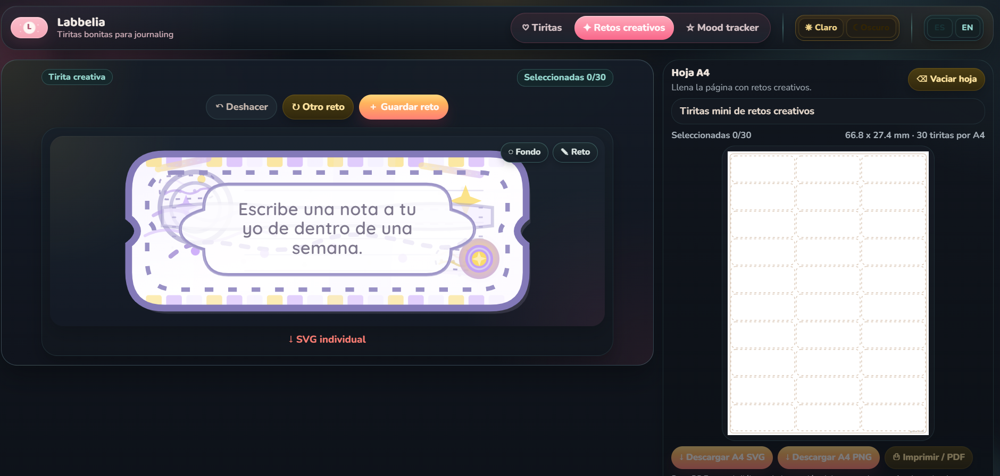
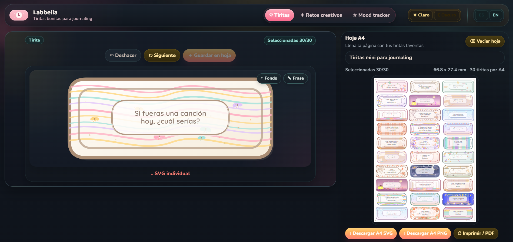

# Labbelia

Labbelia is a tiny bilingual journaling label studio. It generates cute printable SVG labels from a curated prompt bank, lets you fill an A4 sheet with standard label presets, and export the result for printing or sharing.

<p align="center">
  
</p>

## Stack

- React
- TypeScript
- Vite
- SVG-based printable labels

## What is included

- Spanish and English UI
- Curated prompt bank with duplicate-heavy source material trimmed down
- Several visual label families: antique stamp, space, fair ticket, soft geometry, flora, weather, and critters
- A4 sheet preview based on standard print-friendly label sizes
- Export to printable PDF through the browser print dialog
- SVG and PNG export for the composed sheet
- SVG export for individual labels

## Gallery

<p align="center">
  
  
</p>

<p align="center">
  
  
</p>

## Run locally

```bash
npm install
npm run dev
```

## Build

```bash
npm run build
```
